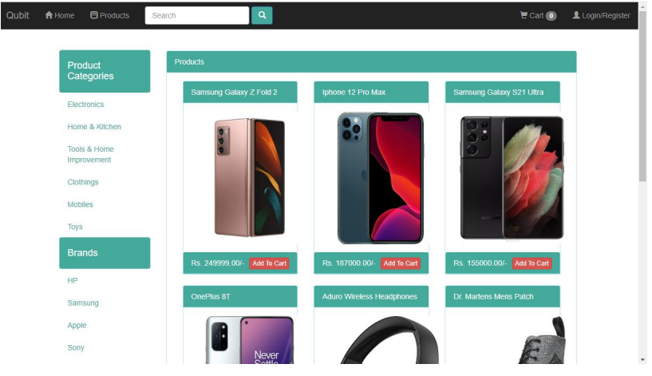

# E-commerce Web Application: Qubit

Qubit is a specialized e-commerce platform for electronic gadgets, offering an extensive catalog of laptops, desktops, smartphones, and more. With a user-friendly interface and secure payment integration, Qubit ensures a seamless shopping experience.

---

## Features

1. **Main**  
   

      
   

   Provides secure access to user accounts with advanced password hashing techniques.

2. **Paypal**  
   

      
   

   Displays a comprehensive overview of available products.

3. 
   

      
   

   Simplifies the checkout process with a detailed cart and PayPal integration.

---

## Technologies Used
- **Frontend**: HTML, CSS, JavaScript  
- **Backend**: PHP, MySQL  

---

## System Snapshots
Explore additional features in the [System Snapshots](./screenshots) folder.
